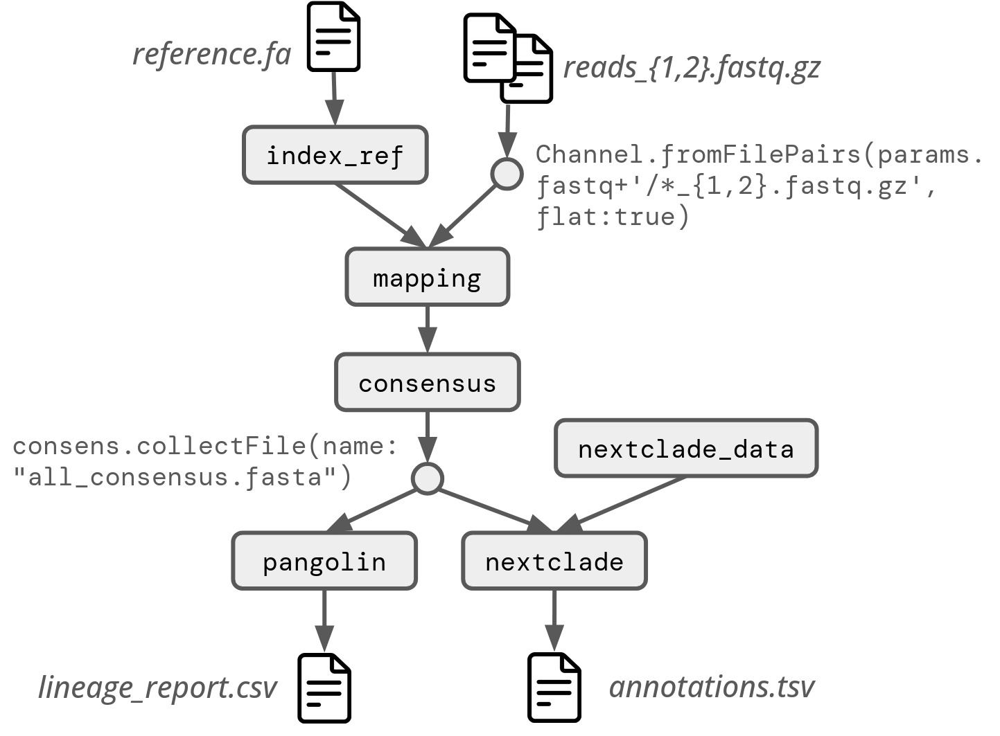

# Computational Reproducibility With Scientific Workflows: Analysing viral genomes with Nextflow

An ACM Rep 2025 tutoriel


* I. [Abstract](#Abstract)
* II. [Learning Objectives and outline](#LearningObjectivesandoutline)
* III. [Tutoriel Material](#TutorielMaterial)
	* A. [Lecture](#Lecture)
	* B. [Pratical Session](#PraticalSession)
		* a. [Objectif](#Objectif)
		* b. [Input data](#Inputdata)
		* c. [Detailed steps](#Detailedsteps)
		* d. [List of tools needed](#Listoftoolsneeded)
		* e. [Analysis Questions](#AnalysisQuestions)
		* f. [Correction](#Correction)
	* C. [Reproducibility consensus](#Reproducibilityconsensus)
* IV. [Intended Audience, Format and Special Equipment Needs](#IntendedAudienceFormatandSpecialEquipmentNeeds)
* V. [Authors](#Authors)
* VI. [References](#References)
* VII. [TODO](#TODO)


##  I. <a name='Abstract'></a>Abstract 

In an era of generation of large datasets and complex scientific analyses, ensuring the reproducibility of data analyses has become paramount. Workflow management systems have emerged as a key solution to this challenge. By managing the software environment, task scheduling, parallelisation and communication with the execution machines (HPC, cloud, etc.), they significantly facilitate workflow development compared to historical practices (e.g., simple bash scripts), all while ensuring scalablility and a high level of reproducibility [2]. However, while they are becoming more popular, workflow management systems have not yet gained wide adoption within the scientific community, largely due to established practices and the perceived high learning curve associated with their use. 

This tutorial aims at demonstrating the critical role of workflow management systems in implementing reproducible data analyses, with an emphasis on their capacity to encapsulate heterogeneous code, manage software environments, scale with the data size, and leverage heterogeneous computational resources efficiently. To do so, we will use the Nextflow [1] workflow system and a viral genome sequence reconstruction pipeline as a use case. This will demonstrate the fundamentals of Nextflow and illustrate how it can be used to easily implement, execute, and share a simple workflow. 

##  II. <a name='LearningObjectivesandoutline'></a>Learning Objectives and outline

Key learning outcomes include (i) acquiring basic workflow concepts (ii) learning how to implement simple workflows and (iii) understanding the capabilities of workflow management systems in encapsulating heterogeneous code, scalability, software environment management, and computational resource management. The tutorial will be organized in three phases.
1. We will start with a short lecture to present the main challenges in implementing reproducible data analyses, specifically using a motivating example for illustration. We will then introduce how workflow management systems are capable of solving these challenges. To achieve this, we will present the Nextflow framework and then demonstrate how it can be used to solve the motivating example. Finally, we will introduce the analysis pipeline to implement as a workflow. It consists of several viral genome sequencing datasets that need to go through multiple analysis steps in order to reconstruct full viral genomes with their annotations.
2. The second part of the tutorial will consist of a practical session, during which the participants will implement the analysis using the Nextflow management system. The session will be highly interactive, featuring coding demonstrations and structured group discussions, which will allow participants to apply their knowledge, with organizers providing support and answering questions. 
3. The tutorial will conclude with a discussion and survey on the challenges encountered. We will then conduct a reproducibility consensus by evaluating the results provided by the participants, where we as a group will assess the level of reproducibility achieved, fostering a collaborative evaluation of the reproducibility achieved. 

By the end of the tutorial, participants will have a solid foundation in workflow management systems and be capable of designing and implementing reproducible data analysis workflows, aligning with the broader goals and themes of [ACM REP 2025]().

##  III. <a name='TutorielMaterial'></a>Tutoriel Material

###  A. <a name='Lecture'></a>Lecture

Link to the lecture slides can be found [here]().

###  B. <a name='PraticalSession'></a>Pratical Session

####  a. <a name='Objectif'></a>Objectif 

The goal is to analyse a SARS-CoV-2 sequencing dataset, in order to:
1. Infer the full sequence of the virus
2. Detect the [clade](https://clades.nextstrain.org/) (alpha, beta, etc.). 

To do so we will start from a sample that has been sequenced on an Illumina sequencer, and we will run the following steps:

1. Mapping the reads on a reference genome
2. SNP Calling
3. Building consensus sequence
4. Detect clade

The resulting workflow should look like this:




####  b. <a name='Inputdata'></a>Input data

It consists of: 

- Two compressed fastq files containing paired-end reads from Amplicon sequencing a SARS-CoV2 sample. Which can be downloaded here:
  - Reads 1: [here]()
  - Reads 2: [here](https://dl.psteur.fr/fop/qfY4jEJ6/SRR13182925_2.fastq.gz)
- The reference genome to map the reads against (https://www.ncbi.nlm.nih.gov/nuccore/MN908947). Which can be download here:
  - [reference]()

####  c. <a name='Detailedsteps'></a>Detailed steps

##### 1. Mapping the reads on a reference genome

- Read mapping will be performed using [bwa mem](https://github.com/lh3/bwa) .
- Command lines:

  - Indexing the reference genome:
    ```
    bwa index reference.fa
    ```

  - Mapping the reads:
    ```
    bwa mem -t 1 reference.fa reads1.fq reads2.fq > tmp.sam
    ```  

  - Converting sam file to bam file:
    ```
    samtools sort -o sample.bam tmp.sam
    samtools index sample.bam
    ```

##### 2. SNP Calling

- SNP Calling will be performed with [iVAR](https://andersen-lab.github.io/ivar/html/manualpage.html).
- Command lines:
  ```
  samtools mpileup -A -d 600000 --reference reference.fasta -B -Q 0 sample.bam | ivar variants -r reference.fa -p sample.variants -q 0 -t 0.02
  ```

##### 3. Building consensus sequence

- Consensus sequence will be inferred also using [iVAR](https://andersen-lab.github.io/ivar/html/manualpage.html) 
- Command lines: 
  ```
  samtools mpileup -d 600000 -A -Q 0 -F 0 sample.bam | ivar consensus -q 20 -t 0 -m 5 -n N -p sample_consensus
  ```

##### 4. Detecting clade

Bla bla diferrence between nexclade and Pangolin

* Detecting clade ([NextClade](https://clades.nextstrain.org/))
  * Clade detection is performed by Nextclade.
  * You will first need to download the sars-cov-2 reference files:
    ```
    nextclade dataset get --name 'sars-cov-2' --output-dir 'ncref'
    ```
  * Then, use these reference files along the fasta file to annotate the sample consensus:
    ```
    nextclade run --in-order --input-dataset ${ncref} --output-tsv 'annotations.tsv'  ${seq}
    sed -i 's/\\x0D\$//' annotations.tsv

* Detecting clade ([Pangolin](https://cov-lineages.org/))
  * Clade detection is performed by Pangolin.
  * Command lines:
    ```
    PATH=/opt/conda/envs/pangolin/bin/:\$PATH
    pangolin --usher 'sample_consensus.fa' -t 20 --outfile Pangolin_lineage_report.csv
    ```

####  d. <a name='Listoftoolsneeded'></a>List of tools needed

Here are the list of tools you will need in the workflow with a corresponding container to use them:

| Tool  | Container  |
|---|---|
|  [samtools](https://github.com/samtools/samtools>) |  `evolbioinfo/samtools:v1.11` |
|  [iVAR](https://andersen-lab.github.io/ivar/html/manualpage.html) | `evolbioinfo/ivar:v1.3.1`  |
|  [Nextclade](https://clades.nextstrain.org/) | `nextstrain/nextclade:3.13.3`  |
|  [Pangolin](https://cov-lineages.org/) |  `evolbioinfo/pangolin:v4.3.1-v1.33-v0.3.19-v0.1.12` |
| [bwa](https://github.com/lh3/bwa)   | `evolbioinfo/bwa:v0.7.17`  |


####  e. <a name='AnalysisQuestions'></a>Analysis Questions

After running the workflow, we can analyse the resutls
* Using the xx file and the xx website, determine what lineage/clade is the sample?
* What year do you estimate the sequence samples were obtained (using the xx website)?
* Why is it important to regurlay sequence a viruses genetique code (espicially from different areas and at different times)?

####  f. <a name='Correction'></a>Correction   

A correction workflow will be added to the repo at the end of the tutoriel       


<!--TODO Fill this out-->

###  C. <a name='Reproducibilityconsensus'></a>Reproducibility consensus

Link to reproducibility consensus workflow can be found [here]()

##  IV. <a name='IntendedAudienceFormatandSpecialEquipmentNeeds'></a>Intended Audience, Format and Special Equipment Needs

* Intended Audience: This introductory-level tutorial is targeted at scientists with an informatics background who analyse data in their projects. Participants should have an intermediate level of proficiency in Bash (navigate a terminal, install software, manage dependencies). No prior bioinformatics or biological knowledge is needed.
* Format: The tutorial will follow a hybrid format, one instructor will be at the conference, while another will be connected remotely.
* Length: The tutorial will last half a day (3 hours).
* Special Equipment Needs: Participants will need access to a terminal (Linux or Mac) and should have Apptainer/Docker and Nextflow installed prior to the tutorial, for infromation to install the different software, see here
  * link
  * link
  * link

##  V. <a name='Authors'></a>Authors 

<!--TODO add ORcid for authors-->

* [George Marchment](https://orcid.org/0000-0002-4565-3940)
* [Sarah Cohen-Boulakia](https://orcid.org/0000-0002-7439-1441)
* [Frédéric Lemoine](https://orcid.org/0000-0001-9576-4449)

##  VI. <a name='References'></a>References 

<!--TODO fill this out-->
__________________________________


##  VII. <a name='TODO'></a>TODO 

* Prepare readme for website
* Prepare slides for tutoriel
* Prepare correction of workflow 
* prepare scipt which automatically verifies the validty of result (possibly have different levels of reproducibility)
* 