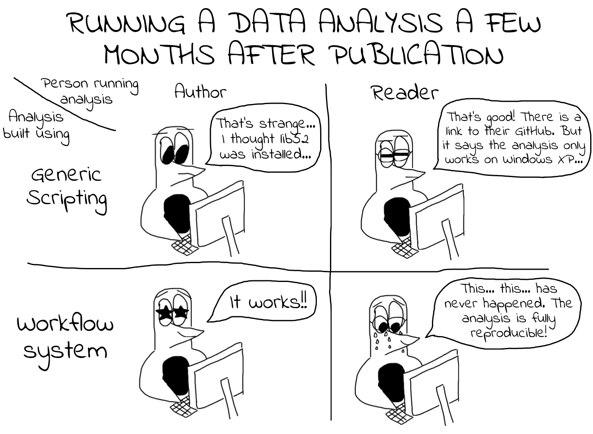

# Computational Reproducibility With Scientific Workflows: Analysing viral genomes with Nextflow

Welcome to the 2025 ACM REP tutorial.

* The link to the tutorial's website can be found [here](https://george-marchment.github.io/acmrep25/).
* The link to the tutorial's lecture slides can be found [here](https://github.com/George-Marchment/acmrep25/blob/main/tutoriel_material/slides.pdf).

## Abstract

In an era of generation of large datasets and complex scientific analyses, ensuring the reproducibility of data analyses has become paramount. Workflow management systems have emerged as a key solution to this challenge, offering structured, automated, and scalable frameworks for handling data processing tasks, allowing for the development of scientific workflows. However, while they are becoming more popular, workflow management systems have not yet gained wide adoption within the scientific community, largely due to established practices and the perceived high learning curve associated with their use.

This tutorial aims at demonstrating the critical role of workflow management systems in implementing reproducible data analyses, with an emphasis on their capacity to encapsulate heterogeneous code, manage software environments, scale with the data size, and leverage heterogeneous computational resources efficiently. To do so, we will use the Nextflow workflow system and a viral genome sequence reconstruction pipeline as a use case. This will demonstrate the fundamentals of Nextflow and illustrate how it can be used to easily implement, execute, and share a simple workflow.

## Learning Objectives and outline

Key learning outcomes include (i) acquiring basic workflow concepts
(ii) learning how to implement simple workflows and (iii) understanding the capabilities of workflow management systems in encapsulating heterogeneous code, scalability, software environment management, and computational resource management. 
The tutorial will be organized in three phases.

1. We will start with a **short lecture** to present the main challenges in implementing reproducible data analyses, specifically using a motivating example for illustration. We will then introduce how workflow management systems are capable of solving these challenges. To achieve this, we will present the Nextflow framework and then demonstrate how it can be used to solve the motivating example. Finally, we will introduce the analysis pipeline to implement as a workflow. It consists of several viral genome sequencing datasets that need to go through multiple analysis steps in order to reconstruct full viral genomes with their annotations.
2. The second part of the tutorial will consist of a **practical session**, during which the participants will implement the analysis using the Nextflow management system. The session will be highly interactive, featuring coding demonstrations and structured group discussions, which will allow participants to apply their knowledge, with organizers providing support and answering questions. 
3. The tutorial will conclude with a **discussion and survey** on the challenges encountered. We will then conduct a reproducibility consensus by evaluating the results provided by the participants, where we as a group will assess the level of reproducibility achieved, fostering a collaborative evaluation of the reproducibility achieved.

By the end of the tutorial, participants will have a solid foundation in workflow management systems and be capable of designing and implementing reproducible data analysis workflows, aligning with the broader goals and themes of ACM REP 2025.