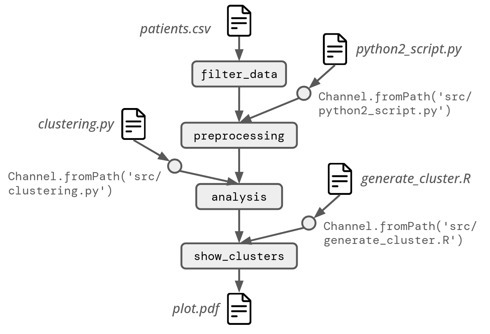

# Use-Case Workflow

This Nextflow Workflow is an implementation of the use-case presented in the intro to the [lecture](https://github.com/George-Marchment/acmrep25/blob/main/tutoriel_material/slides.pdf) for ACM REP 2025 tutorial "Computational Reproducibility With Scientific Workflows: Analysing viral genomes with Nextflow".

This workflow is composed of 4 steps:
1. A data cleaning step
2. A preprocessing step
3. The analysis step (clustering)
4. The visualisation of the clusters



It is interestring to use a Nextflow workflow to orchestrate this analysis since the 4 steps each rely on a different computer language:
1. Relies on *bash*
2. Relies on *python 2*
3. Relies on *python 3*
4. Relies on *R*

To run the analysis (using *Apptainer*), simply run the following command:
```
nextflow workflow.nf
```

> To use *Docker* instead of *Apptainer*, simply change "`apptainer`" to "`docker`" in the `nextflow.config` file.